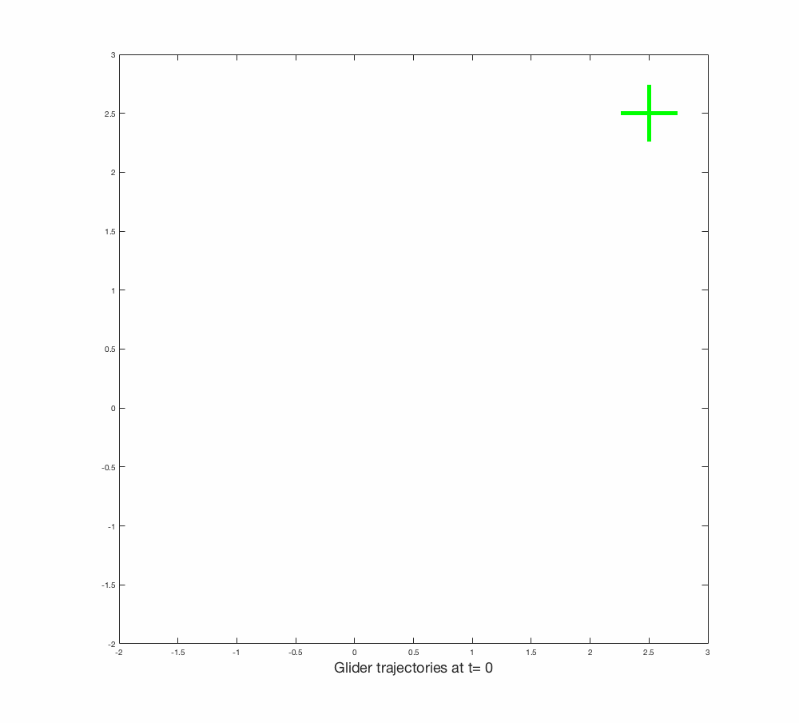
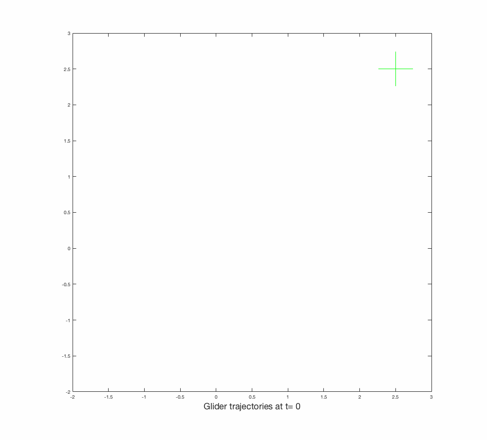
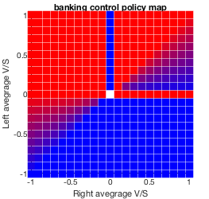

# Multi-UAV active thermal sensing

Like birds, gliders soar by gaining power from thermals, columns of rising air of varying sizes and strengths. 
In the absence of wind, gliders descend down a path governed by the gliding ratio. 
But by exploiting the upwind present in thermals, gliders are not only able to keep afloat, but also gain height by circling in on the column of rising air. 
This practice, known as *thermaling*, is also common among large birds to conserve energy. 
But thermals are by nature not visible, and could not be remotely sensed, meaning that its information is only locally available. 
This makes it difficult for a single glider to search for thermals on its own. 
Yet each glider could monitor the relative motion of its neighbors and thus navigate towards areas of stronger upwinds. Our hypothesis is that a group of UAV gliders could reach a consensus about the optimal position, and navigate themselves to a formation that benefits most out of the thermal.

## Thermal model
Allen's https://ntrs.nasa.gov/archive/nasa/casi.ntrs.nasa.gov/20060004052.pdf cited by
http://digitalcommons.calpoly.edu/cgi/viewcontent.cgi?article=1465&context=theses

https://www.nrl.navy.mil/content_images/11_FA1.pdf
" thermal is radially symmetric about
a center point, does not create horizontal winds, drifts
with the ambient wind velocity, and is invariant with
altitude and time. Figure 1 shows the modified threedimensional
Gaussian distribution chosen to represent
vertical wind speeds in a thermal. Its main features
are the characteristic “core” region of rising air and a
ring of sinking air around the core. This reduced-order
model is based on four parameters: the two-dimensional
center location, peak updraft strength, and characteristic
radius"

estimating a modified Gaussian model by recursive UKF from total energy
 
## Challenges/Significance
The challenges are twofold:

- gliders cannot sense each thermal individually, they only measure the total upwash contribution from all thermals from their positions
__Solution__: We model the wind velocity induced by each thermal as a scalar field that
- gliders are constantly on the fly can cannot be modeled by single integrator dynamics

## Estimation
Each glider maintains a belief vector over the strengths of thermals centered on a grid of known locations. It is expected that, similar to range-only mapping, encountering each thermal would decrease the uncertainty in the respective strength.

Estimation is coupled with control in this active sensing problem,
## Simulation setup

## Naive Policies
Naive, binary policies {0,1} are not sufficient.
### Left/Right
Gliders either turn left(CCW) or right(CW) by comparing the average sink rate of gliders on its left and right side.

### Left/Straight
Gliders either turn left(CCW) or head straight by comparing the average sink rate of gliders on its left and its own sink rate.

### L/R Tracking
Gliders track the particles with single integrator dynamics with L/R control.

The issue with tracking setpoint with L/R control: the glider aligns itself quickly, but once it reaches the point, it just passes with no return. => L/R logic cannot distinguish approach/departure => need to incorporate information on rate-of-change in distance.

## Banking Control
Tangent of the banking angle tan(theta)::[-1,1] is mapped from left and right average vertical speeds as follows.

The results are still not satisfactory, such that some thermal centering algorithm is necessary beside consensus control.

ALOFT: Thermal centering algorithm
http://citeseerx.ist.psu.edu/viewdoc/download?doi=10.1.1.944.7000&rep=rep1&type=pdf

## Thermal Centering
[https://www.youtube.com/watch?v=d5WoZTN0kvE]
## Reference
