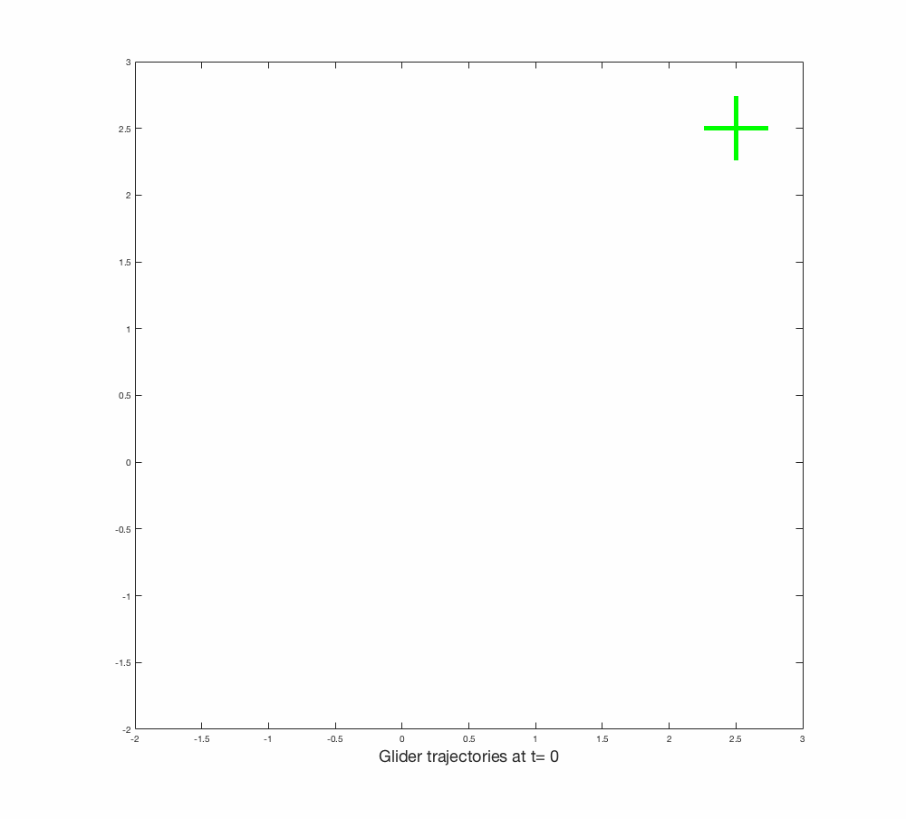

## Control Algorithms for Collaborative Thermal Sensing Consensus

Here are simulation playbacks from various trials, followed by our main result.

## Naive Policies
Naive, binary policies {0,1} are not sufficient.
### Left/Right
Gliders either turn left(CCW) or right(CW) by comparing the average sink rate of gliders on its left and right side.

### Left/Straight
Gliders either turn left(CCW) or head straight by comparing the average sink rate of gliders on its left and its own sink rate.

## Banking Control
Tangent of the banking angle tan(theta)::[-1,1] is mapped from left and right average vertical speeds as follows.

But results show no improvement.

## Field-of-View Control
In this first scenario, the bottom left glider is significantly closer to the optimal thermal and therefore circles in to attract other gliders toward this area. Although one of the gliders failes to reach rendezvous before it has to land, the trend obviously demonstrates the consensus.

In this second scenario, the gliders on bottom left and top right are similarly close to the optimal and suboptimal thermals. Some dispute initiates as the top right glider believes it is dominant, but soon resolved when it realizes the dominant influence from the bottom left. As a result, consensus is reached in the vicinity of the optimal thermal, no the suboptimal one.

