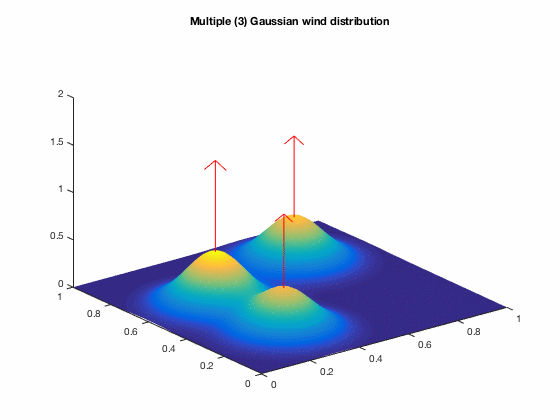

# Wind model

The vertical wind velocity distribution is modelled as a scalar field with Gaussian components.
The mean are located arbitrarily and covariance is identical across different components. 
The magnitude of each Gaussian component varies as a sinusoidal function in time with identical periods and arbitrary phase shifts.

